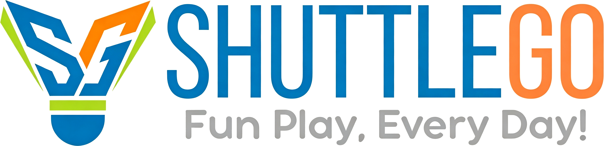

# ShuttleGo 官网重建规范文档
**版本：** v1.0  
**日期：** 2026年4月  
**文件类型：** 单页静态网站（Single-page HTML）  
**对应源文件：** `index.html`（含内联 CSS + JS，无外部依赖框架）

---

## 目录

1. [项目概述](#1-项目概述)
2. [文件结构与依赖](#2-文件结构与依赖)
3. [设计系统（Design System）](#3-设计系统)
4. [页面整体布局](#4-页面整体布局)
5. [导航栏](#5-导航栏)
6. [各页面区块详细规范](#6-各页面区块详细规范)
7. [交互行为规范](#7-交互行为规范)
8. [国际化（i18n）规范](#8-国际化i18n规范)
9. [响应式断点](#9-响应式断点)
10. [图片资源清单](#10-图片资源清单)
11. [已知注意事项](#11-已知注意事项)

---

## 1. 项目概述

**品牌名称：** ShuttleGo  
**Slogan：** Fun Play, Every Day!  
**定位：** 羽毛球 & 匹克球社区平台官网（澳大利亚市场）  
**核心目标：** 向潜在用户介绍 App 功能，促进下载和注册，展示商城产品  
**网站类型：** 单文件静态页，无后端，无构建工具  
**页面语言：** 根据浏览器语言自动切换中/英文，右上角可手动切换

---

## 2. 文件结构与依赖

### 文件清单

```
/
├── index.html                  # 主文件，含全部 CSS + JS（内联）
├── logo.png                    # 导航栏 Logo（150×40px）
├── shuttlecock-vertical-48.png # 羽毛球图标（50×50px，商城用）
├── pickleball-small-200.png    # 匹克球图标（多尺寸复用）
```

### 外部字体（Google Fonts CDN）

```html
<link href="https://fonts.googleapis.com/css2?family=Playfair+Display:ital,wght@0,400;0,600;0,700;0,900;1,400;1,700&family=Montserrat:wght@300;400;500;600;700&display=swap" rel="stylesheet">
```

- **Playfair Display** — 标题、品牌名、数字统计、区块大标题（Serif，衬线体）
- **Montserrat** — 正文、导航、按钮、标签（Sans-serif，无衬线体）

### 无其他外部依赖

- 无 jQuery / React / Vue
- 无外部 CSS 框架（无 Bootstrap / Tailwind）
- 无地图 SDK（地图为纯 CSS + HTML 模拟实现）
- 所有逻辑使用原生 Vanilla JS

---

## 3. 设计系统

### 3.1 品牌色彩

| 变量名 | 色值 | 用途 |
|--------|------|------|
| `--blue` | `#2391dc` | 主色，按钮、链接、强调 |
| `--orange` | `#fe870a` | 辅色，价格、标签、次要按钮 |
| `--green` | `#b7da28` | 装饰色，分割线、section 标签、badge |
| `--blue-dark` | `#1a6fa8` | 按钮 hover 深色 |
| `--orange-dark` | `#d96e00` | 橙色 hover 深色 |

### 3.2 亮模式语义色（`:root`）

| 变量名 | 色值 | 用途 |
|--------|------|------|
| `--text-dark` | `#1a1a2e` | 主文字 |
| `--text-mid` | `#3a3a5c` | 次要文字、导航链接 |
| `--text-light` | `#6b6b8a` | 说明文字、占位文字 |
| `--bg-light` | `#fff9f3` | 主背景（main panel） |
| `--bg-card` | `#ffffff` | 卡片背景 |
| `--bg-section` | `#fdf4ea` | 交替 section 背景 |
| `--border` | `rgba(183,218,40,0.3)` | 边框 |
| `--shadow` | `0 8px 40px rgba(35,145,220,0.10)` | 卡片阴影 |
| `--page-bg-start` | `#fef8f0` | 页面两侧渐变起点 |
| `--page-bg-end` | `#f0f5ea` | 页面两侧渐变终点 |

### 3.3 暗模式语义色（`[data-theme="dark"]`）

| 变量名 | 色值 |
|--------|------|
| `--text-dark` | `#f0f0ff` |
| `--text-mid` | `#c0c0e0` |
| `--text-light` | `#a0a0c0` |
| `--bg-light` | `#1e1e3a` |
| `--bg-card` | `#252545` |
| `--bg-section` | `#181830` |
| `--border` | `rgba(183,218,40,0.25)` |
| `--shadow` | `0 8px 40px rgba(0,0,0,0.3)` |
| `--page-bg-start` | `#0f111a` |
| `--page-bg-end` | `#1a1a2e` |

### 3.4 全局参数

```css
--radius: 18px;       /* 通用圆角 */
--transition: 0.35s cubic-bezier(0.4,0,0.2,1);  /* 通用过渡曲线 */
```

### 3.5 字体用法规则

| 场景 | 字体 | 粗细 | 大小参考 |
|------|------|------|----------|
| 页面大标题 | Playfair Display | 700~900 | `clamp(2.8rem, 7vw, 5.5rem)` |
| 区块标题 | Playfair Display | 700 | `clamp(2rem, 4vw, 3.2rem)` |
| 卡片标题 | Playfair Display | 700 | `1.4rem` |
| Slogan | Playfair Display | 400 italic | `clamp(1.1rem, 2.5vw, 1.6rem)` |
| 数字统计 | Playfair Display | 900 | `3rem` |
| 正文、导航、按钮 | Montserrat | 400~700 | `0.78rem ~ 1rem` |
| 导航链接 | Montserrat | 600 | `0.82rem`，大写，字间距 0.08em |

### 3.6 通用组件样式

**按钮 — 主按钮（`.btn-primary`）**
- 背景：`var(--blue)`，悬浮变 `--blue-dark`
- 形状：胶囊形（`border-radius: 50px`），`padding: 15px 38px`
- 悬浮：上移 2px + 阴影 + 光晕扫过动画（`::before` 伪元素）

**按钮 — 次按钮（`.btn-secondary`）**
- 透明背景，橙色边框和文字
- 悬浮：橙色填充，文字变白

**卡片通用规则**
- `border-radius: var(--radius)`（18px）
- `border: 1.5px solid var(--border)`
- `box-shadow: var(--shadow)`
- 悬浮：`translateY(-4px ~ -6px)` + 阴影增强

**Section 标签（`.section-label`）**
- 绿色横线（40px 宽，2.5px 高）+ 大写绿色文字
- 用于每个区块的小标题前缀

**分割线（`.divider`）**
- `height: 2px`
- `background: linear-gradient(90deg, transparent, var(--green), transparent)`

---

## 4. 页面整体布局

### 4.1 CSS Grid 三栏居中结构

```css
body {
  background: linear-gradient(135deg, var(--page-bg-start), var(--page-bg-end));
}
.page-wrapper {
  display: grid;
  grid-template-columns: 1fr min(1400px, 100%) 1fr;
  min-height: 100vh;
}
.main-panel {
  grid-column: 2 / 3;
  background: var(--bg-light);
  box-shadow: 0 0 40px rgba(0,0,0,0.08);
}
```

- 正文内容最大宽度 **1400px**，居中显示
- 两侧为渐变背景色留白
- `<nav>`、`<div id="floaters">`、`<div id="cursor">` 放在 `.page-wrapper` **外部**（fixed 定位需要独立于 grid）

### 4.2 页面 DOM 结构

```
<body>
  <div id="cursor">               ← 自定义鼠标指针
  <div id="floaters">             ← 浮动羽毛球/匹克球粒子
  <div class="page-wrapper">
    <div class="main-panel">
      <section id="home">         ← Hero 首页
      <div class="divider">
      <section id="about">        ← 数据统计
      <div class="divider">
      <section id="features">     ← 核心功能（4个卡片）
      <div class="divider">
      <section id="rewards">      ← 注册奖励
      <div class="divider">
      <section id="shop">         ← 装备商城
      <div class="divider">
      <section id="download">     ← App 下载
      <div class="divider">
      <section id="contact">      ← 联系方式
      <footer>
    </div>
  </div>
  <nav>                           ← 导航（在 page-wrapper 外）
  <div class="mobile-menu">       ← 移动端菜单（在 page-wrapper 外）
  <script>                        ← 全部 JS 内联在底部
```

---

## 5. 导航栏

### 5.1 结构

- **位置：** `position: fixed; top:0; left:0; right:0; z-index:1000`
- **高度：** 70px
- **背景：** `rgba(255,249,243,0.88)` + `backdrop-filter: blur(18px)`（毛玻璃）
- **暗模式背景：** `rgba(18,18,42,0.88)`

### 5.2 左侧 — Logo

```html
<a href="#home" class="logo clickable">
  
</a>
```
- `logo-img` 尺寸：`width: 150px; height: 40px; object-fit: contain`
- **注意：** 不要用 `<div class="logo">` 额外包裹（会导致双重 flex 嵌套）

### 5.3 中间 — 导航链接

6个锚点链接：About / Features / Rewards / Shop / Download / Contact  
悬浮效果：文字变橙色 + 底部橙色下划线从左展开（`scaleX` 动画）

### 5.4 右侧 — 设置按钮

```html
<button class="settings-btn" id="settingsBtn">  ← 齿轮图标 SVG
<div class="settings-menu" id="settingsMenu">   ← 下拉菜单
  语言切换（English / 中文）
  模式切换（Light / Dark）
```

**设置菜单定位规则：**
```css
.settings-menu {
  position: fixed;      /* 必须用 fixed，不能用 absolute */
  top: 70px;
  right: 5vw;
  z-index: 9990;        /* 必须高于 nav 的 1000 */
}
```

**点击逻辑（JS）：**
```js
// 使用 open 状态标志，防止 document.click 与按钮 click 互相干扰
let open = false;
btn.addEventListener('click', e => { e.stopPropagation(); open ? closeMenu() : openMenu(); });
document.addEventListener('click', () => { if(open) closeMenu(); });
menu.addEventListener('click', e => e.stopPropagation());
```

### 5.5 移动端汉堡菜单

- `≤900px` 时隐藏导航链接，显示汉堡图标
- 点击展开 `.mobile-menu`（`position:fixed; top:70px`）
- 包含全部 6 个导航链接

---

## 6. 各页面区块详细规范

### 6.1 Hero（`#home`）

**背景：**  
`linear-gradient(135deg, rgba(35,145,220,0.03) 0%, rgba(254,135,10,0.03) 50%, rgba(183,218,40,0.03) 100%)`

**旋转球拍动画（`.hero-racket-anim`）：**
- 三个球拍SVG呈奔驰标志120°分布，绕中心缓转
- 蓝色：羽毛球拍（椭圆形）；橙色：匹克球拍（圆角矩形）；绿色：网球拍（椭圆+横线）
- `animation: racket-spin 18s linear infinite`
- `opacity: 0.15`，`pointer-events: none`

**内容元素（从上到下）：**

1. **Hero Tag：** 橙色药丸标签，`🏸 Badminton & Pickleball Platform`
2. **H1 三行标题：**
   - 行1：默认色（Play More. / 多玩球。）
   - 行2：蓝色（Connect Better. / 多交友。）
   - 行3：橙色（Live Healthier. / 更健康。）
3. **Slogan：** `Shuttle Go — Fun Play, Every Day!`（Playfair，斜体）
4. **副标题：** 简介文字
5. **两个按钮：** Download App（主按钮）+ Explore Features（次按钮）

---

### 6.2 平台数据（`#about`）

**背景：** `var(--bg-section)`  
**内容：** section 小标签 + 大标题 + 说明文字 + 4格统计卡片

**数据卡片（`.stats-grid`，4列）：**

| 数字 | 标签（EN） | 标签（ZH） |
|------|-----------|-----------|
| 200+ | Venues | 场馆 |
| 1,500+ | Sessions / Month | 活动 / 月 |
| 25+ | Cities | 城市 |
| 8,000+ | Active Players | 活跃球员 |

数字使用 `background-clip: text` 渐变色（蓝→橙）

---

### 6.3 核心功能（`#features`）

**布局：** 2列 Grid，4张功能卡片  
**卡片结构：** `.feature-header`（图标 + 标题 + 描述）+ `.feature-body`（内容）

#### 卡片1 — Session Finder（活动查找）
- 图标：匹克球图片（`.pickleball-img`，28×28px），橙色背景
- 内容：地图轮播（2个 slide）
  - **Slide 1（id=`slide_s1`）：** 悉尼地图，2个气泡
    - 气泡A：📍 2.36km，ABC Club @ Sydney Olympic Park，Social Session，4 courts，24人，Intermediate+
    - 气泡B：📍 1.72km，Jeremy's Group @ Marrickville Indoor，1 court，6人，All levels welcome
  - **Slide 2（id=`slide_s2`）：** 墨尔本地图，2个气泡（匹克球）
    - 气泡A：📍 2.1km，Alphington Sports Centre，3 courts，12人
    - 气泡B：📍 4.5km，MSAC，Competitive Round Robin，6 courts
  - 轮播控制：左右箭头 + 圆点指示器 + 标签（`id="slide_s_label"`）

#### 卡片2 — Venue Search（场馆搜索）
- 图标：🗺️，橙色背景
- 内容：地图轮播（2个 slide）
  - **Slide 1（id=`slide_v1`）：** 阿德莱德地图，2个气泡
    - 气泡A：📍 5.2km，Badminton SA Centre，Wayville SA 5034，Open Now，8 courts
    - 气泡B：📍 3.4km，Marion Indoor Stadium，Mitchell Park SA 5043，Closed，Opens 6pm
  - **Slide 2（id=`slide_v2`）：** 布里斯班地图，2个气泡（匹克球）
    - 气泡A：📍 0.9km，Brisbane Pickleball Club，Coorparoo QLD 4151，Open Now，4 courts
    - 气泡B：📍 2.7km，RNA Showgrounds Courts，Bowen Hills QLD 4006，Open Now，6 courts
  - 轮播控制标签 ID：`id="slide_v_label"`

#### 卡片3 — Club & Group Centre（俱乐部&群组）
- 图标：🏆，绿色背景
- 内容：4个功能项（✓ 列表）
  - Create Club or Group（公开/私密）
  - Manage Members（审批、邀请、移除）
  - Session Controls（人数、场地、级别、收费）
  - Analytics Dashboard（出席率、收益、互动）

#### 卡片4 — Gear Shop（装备商城）
- 图标：🛍️，紫色背景
- 内容：2×2 格子，4个品类概览
  - 🏸 Shuttlecocks（SG-10~SG-50，最高35%折）
  - 🎾 Restringing（穿线，最高50%折）
  - 匹克球图片 + Pickleball Gear（30% off w/ Token）
  - 🪙 Token Rewards（Join free）

**地图模块通用结构：**
```
.map-demo > .map-canvas > .map-bg
  ├── .map-road × 4（横竖道路条）
  ├── .map-label（城市名标签）
  ├── .map-user（蓝色圆形用户图标，含脉冲动画）
  ├── .map-bubble × 2（气泡信息卡）
  └── .map-dot × 2（场馆位置圆点）
```

---

### 6.4 注册奖励（`#rewards`）

**背景：** `linear-gradient(135deg, var(--bg-section) 0%, rgba(183,218,40,0.05) 100%)`  
**布局：** `rewards-container`，2列 Grid（`1fr 1fr`，gap 40px）

**左侧面板（`.rewards-panel`）— 4步流程：**

| 步骤 | 标题 | 说明 |
|------|------|------|
| 1 | Download & Register | 使用官方邀请码注册，无广告体验 |
| 2 | Enter Official Code | 输入 `GI12345`，获得 100 Token |
| 3 | Share Your Code | 专属码 `DI12345`，双方各得 100 Token |
| 4 | Spend Tokens | 装备最高35%折，穿线最高50%折 |

邀请码样式（`.code-box`）：虚线蓝色边框，monospace 字体，蓝/橙色

**右侧面板（`.rewards-panel`）— Token 卡片：**
- 顶部：🪙 渐变圆形图标（橙→蓝）
- 标题 + 说明文字
- 2×2 数据格：100（注册）/ +100（邀请）/ 35%（装备折扣）/ 50%（穿线折扣）

---

### 6.5 装备商城（`#shop`）

**Tab 切换：** 羽毛球 / 匹克球（胶囊形 Tab Bar）

#### 羽毛球 Tab（`#tab_badminton_content`，默认激活）

**羽毛球产品（4列 Grid）：**

| 产品 | 零售价 | Token 价 |
|------|--------|---------|
| SG-10 | $42.00 | $27.00 |
| SG-20 | $44.90 | $29.90 |
| SG-30 | $47.00 | $32.00 |
| SG-50 | $49.90 | $35.00 |

图片：`shuttlecock-vertical-48.png`（50×50px）

**穿线服务（4列 Grid）：**

| 服务 | 零售价 | Token 价 |
|------|--------|---------|
| Labour Only (BYO String) | $25.00 | $10.00 |
| General String | $30.00 | $20.00 |
| Yonex String (BG65, BG80 etc.) | $35.00 | $25.00 |
| Grommet Replacement | $10.00 | $5.00 |

#### 匹克球 Tab（`#tab_pickleball_content`）

**球拍（4列 Grid，Token 价 = 零售价 × 70%）：**

| 产品 | 零售价 | Token 价 |
|------|--------|---------|
| Control Pro Paddle | $89.00 | $62.30 |
| Power Drive Paddle | $129.00 | $90.30 |
| Elite Carbon Paddle | $189.00 | $132.30 |
| Junior Starter Paddle | $49.00 | $34.30 |

**匹克球（4列 Grid，Token 价 = 零售价 × 70%）：**

| 产品 | 零售价 | Token 价 |
|------|--------|---------|
| Indoor Ball (3-pack) | $18.00 | $12.60 |
| Outdoor Ball (3-pack) | $22.00 | $15.40 |
| Tournament Ball (6-pack) | $35.00 | $24.50 |
| Starter Kit Bundle | $65.00 | $45.50 |

---

### 6.6 App 下载（`#download`）

**布局：** 居中，最大宽度 800px  
**内容：** 标题 + 说明 + 2个 QR 卡片（iOS / Android）

每个 QR 卡片包含：
- 150×150px QR 占位图（SVG 模拟图案）
- 平台名称（App Store / Google Play）
- 平台描述
- 下载按钮（主按钮，含平台图标 SVG）

---

### 6.7 联系方式（`#contact`）

**布局：** 6列 Grid（`repeat(6, 1fr)`）

| 图标 | 平台 | 内容 |
|------|------|------|
| 📧 | Email | hello@shuttlego.com.au |
| 💬 | WeChat | vx: shuttlego |
| 👤 | Facebook | @ShuttleGoAu |
| 🎵 | TikTok | @shuttlegoau |
| 📕 | Red Note | shuttlegoau |
| Instagram SVG | Instagram | @shuttlegoau |

Instagram 使用内联 SVG（`viewBox 0 0 24 24`，stroke 风格）

---

### 6.8 页脚（`<footer>`）

- 背景：`var(--text-dark)`（亮模式）/ `#161628`（暗模式）
- 内容：品牌名 + Slogan + 版权 + Privacy Policy / Terms of Service / About 链接
- 版权年份：2026

---

## 7. 交互行为规范

### 7.1 自定义鼠标指针（`#cursor`）

- 半透明蓝色圆点，22×22px，`position:fixed; pointer-events:none; z-index:99999`
- 跟随鼠标，带阻尼（lerp，系数 0.18）
- 亮模式：`mix-blend-mode: multiply`；暗模式：`mix-blend-mode: screen`
- 悬浮在 `.clickable / a / button` 时：扩大至 44×44px，边框变蓝，背景更淡

### 7.2 浮动粒子（`#floaters`）

- 鼠标移动时，在光标附近随机生成 🏸 或 🔍 emoji
- 尺寸 10~18px，`opacity: 0.22`，700ms 后消失（缩小+淡出）
- 触发条件：鼠标移动超过 8px

### 7.3 地图轮播

```js
// 两组独立轮播：key='s'（Session Finder）和 key='v'（Venue Search）
const slideIdx = { s: 0, v: 0 };

function goSlide(key, idx) {
  // 切换 .map-slide 的 active class
  // 更新对应 .carousel-dot 的 active class
  // 更新 #slide_s_label 或 #slide_v_label 的文字
}
function slideMap(key, dir) {
  // 循环切换，dir = +1 或 -1
}
```

轮播标签文字：
- `s`：`['Sydney · Badminton Activities', 'Melbourne · Pickleball Activities']`
- `v`：`['Adelaide · Badminton Venues', 'Brisbane · Pickleball Venues']`

### 7.4 商城 Tab 切换

```js
function switchTab(tab) {
  // 移除所有 .tab-content 和 .tab-btn 的 active
  // 激活 #tab_${tab}_content 和 #tab_${tab}
}
```

默认激活：`badminton`

### 7.5 滚动动画（`.fade-up`）

- CSS 定义 `opacity:0; transform:translateY(40px)`（初始隐藏）
- JS 用 `IntersectionObserver`（`threshold: 0.12`）触发 `.visible` class
- **重要警告：** 在某些嵌入/iframe 渲染环境，Observer 可能无法触发，导致内容不可见。如需兼容，可将 CSS 改为 `opacity:1; transform:none`，放弃滚动动画。

### 7.6 主题切换

```js
function setTheme(t) {
  document.body.setAttribute('data-theme', t); // 'light' 或 'dark'
  localStorage.setItem('sg_theme', t);
}
// 初始化时读取 localStorage，默认 'light'
```

### 7.7 语言切换

```js
function applyLang(lang) {
  document.querySelectorAll('[data-i18n]').forEach(el => {
    el.textContent = i18n[lang][el.getAttribute('data-i18n')];
  });
}
// 初始化：检测 navigator.language，zh 开头 → 中文，否则英文
```

---

## 8. 国际化（i18n）规范

### 8.1 实现方式

- 所有需要翻译的文本节点加 `data-i18n="key"` 属性
- JS 中维护 `i18n.en` 和 `i18n.zh` 两个对象
- 切换时用 `el.textContent = i18n[lang][key]` 替换

### 8.2 完整 Key 列表

| Key | English | 中文 |
|-----|---------|------|
| `nav_about` | About | 关于 |
| `nav_features` | Features | 功能 |
| `nav_rewards` | Rewards | 注册奖励 |
| `nav_shop` | Shop | 商城 |
| `nav_download` | Download | 下载 |
| `nav_contact` | Contact | 联系 |
| `settings_lang` | Language | 语言 |
| `settings_mode` | Display Mode | 显示模式 |
| `mode_light` | Light | 亮色 |
| `mode_dark` | Dark | 暗色 |
| `hero_tag` | 🏸 Badminton & Pickleball Platform | 🏸 羽毛球 & 匹克球平台 |
| `hero_title1` | Play More. | 多玩球。 |
| `hero_title2` | Connect Better. | 多交友。 |
| `hero_title3` | Live Healthier. | 更健康。 |
| `hero_sub` | Find sessions... | 找活动... |
| `hero_btn1` | Download App | 下载App |
| `hero_btn2` | Explore Features | 探索功能 |
| `about_label` | Platform Overview | 平台概览 |
| `about_title` | ShuttleGo by the Numbers | ShuttleGo 数据一览 |
| `about_sub` | We're building... | 我们正在打造... |
| `stat_venues` | Venues | 场馆 |
| `stat_sessions` | Sessions / Month | 活动 / 月 |
| `stat_cities` | Cities | 城市 |
| `stat_users` | Active Players | 活跃球员 |
| `feat_label` | Core Features | 核心功能 |
| `feat_title` | Everything You Need to Play | 一切你需要的，尽在其中 |
| `f1_title` | Session Finder | 活动查找 |
| `f2_title` | Venue Search | 场馆搜索 |
| `f3_title` | Club & Group Centre | 俱乐部 & 群组中心 |
| `f4_title` | Gear Shop | 装备商城 |
| `f3_a` | Create Club or Group | 创建俱乐部或群组 |
| `f3_b` | Manage Members | 管理成员 |
| `f3_c` | Session Controls | 活动设置 |
| `f3_d` | Analytics Dashboard | 数据分析面板 |
| `rewards_label` | Sign-up Bonus | 注册福利 |
| `rewards_title` | Register & Earn Tokens | 注册即得Token |
| `r1_title` | Download & Register | 下载并注册 |
| `r2_title` | Enter Official Code | 输入官方邀请码 |
| `r3_title` | Share Your Code | 分享你的邀请码 |
| `r4_title` | Spend Tokens | 使用Token |
| `token_register` | On Registration | 注册奖励 |
| `token_refer` | Per Referral | 每次成功邀请 |
| `token_gear` | Max Gear Discount | 装备最高折扣 |
| `token_restring` | Max Restring Discount | 穿线最高折扣 |
| `shop_label` | Equipment Store | 装备商城 |
| `shop_title` | Gear Shop | 装备商城 |
| `tab_bad` | Badminton | 羽毛球 |
| `tab_pick` | Pickleball | 匹克球 |
| `shop_shuttles` | Shuttlecocks | 羽毛球 |
| `shop_restring` | Restringing Services | 穿线服务 |
| `shop_paddles` | Paddles | 球拍 |
| `shop_balls` | Pickleballs | 匹克球 |
| `token_price` | with Token | Token最优惠价 |
| `dl_label` | Mobile App | 移动应用 |
| `dl_title` | Download ShuttleGo | 下载 ShuttleGo |
| `dl_ios` | iOS · iPhone & iPad | iOS · iPhone & iPad |
| `dl_android` | Android · All Devices | Android · 全系安卓设备 |
| `dl_ios_btn` | Download for iOS | iOS 下载 |
| `dl_android_btn` | Download for Android | Android 下载 |
| `contact_label` | Get in Touch | 联系我们 |
| `contact_title` | Contact Us | 联系方式 |
| `footer_privacy` | Privacy Policy | 隐私政策 |
| `footer_terms` | Terms of Service | 服务条款 |
| `footer_about` | About | 关于我们 |

---

## 9. 响应式断点

| 断点 | 变化内容 |
|------|---------|
| `≤ 900px` | 导航链接隐藏 → 汉堡菜单；stats-grid 2列；features-grid 1列；rewards-container 1列；products/services-grid 2列；contact-grid 2列；qr-row 垂直排列 |
| `≤ 600px` | stats-grid 2列；products-grid 2列；contact-grid 2列；hero 按钮垂直排列 |
| `≤ 400px` | contact-grid 1列 |

---

## 10. 图片资源清单

| 文件名 | 用途 | 尺寸规格 |
|--------|------|---------|
| `logo.png` | 导航栏品牌 Logo | 显示尺寸 150×40px，`object-fit:contain` |
| `shuttlecock-vertical-48.png` | 商城羽毛球产品图标 | 显示尺寸 50×50px |
| `pickleball-small-200.png` | 多处复用：feature 图标（28×28）、地图气泡（12×12）、商城产品图（50×50）、Tab 按钮（18×18） |

---

## 11. 已知注意事项

1. **`fade-up` 在 iframe/嵌入环境风险：** `IntersectionObserver` 在部分渲染环境无法触发（`opacity:0` 的元素永久不可见）。生产部署到独立域名时正常；如需在 iframe 内运行，建议将 CSS 改为 `opacity:1; transform:none`。

2. **Settings 菜单必须用 `position:fixed`：** 因为 `<nav>` 在 `.page-wrapper` 外部，若用 `position:absolute` 会相对 viewport 错位。

3. **轮播 Label ID 对应关系：**
   - Session Finder 标签：`id="slide_s_label"`
   - Venue Search 标签：`id="slide_v_label"`
   - JS 中 `goSlide(key, idx)` 查找 `#slide_${key}_label`，必须一一对应

4. **Logo 不要双层嵌套：** `<a class="logo">` 内直接放 ``，不要再套 `<div class="logo">`

5. **Cloudflare Email 混淆：** 如网站经过 Cloudflare 代理，Email 地址会被自动替换为 `<a class="__cf_email__">` 并注入解混淆脚本，这是正常现象，非代码错误

6. **`nav` 放在 `page-wrapper` 外：** 注释中标注了这个设计决策——`position:fixed` 元素放在 grid 容器外部，避免影响 grid 布局

7. **Token 折扣计算规则：**  
   - 羽毛球/穿线：使用固定Token优惠价（非比例折扣）  
   - 匹克球产品：Token 价 = 零售价 × 70%（统一30%折）

---

*本文档由 ShuttleGo 开发团队维护，最后更新：2026年4月*
